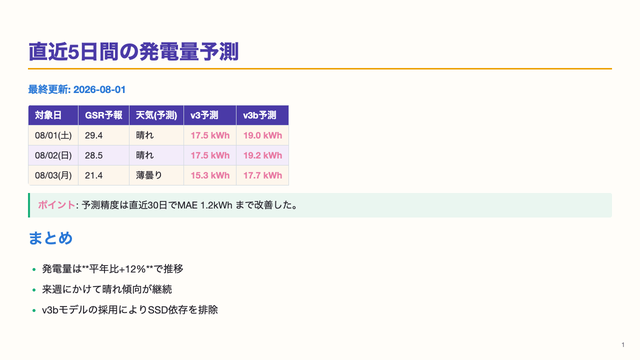
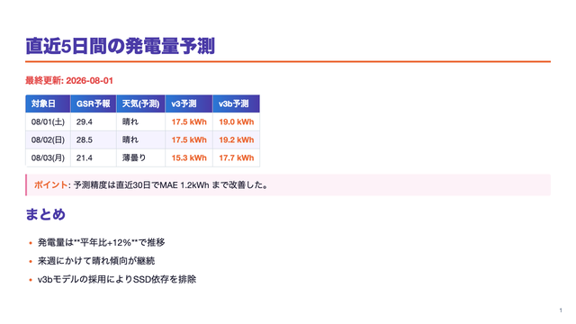
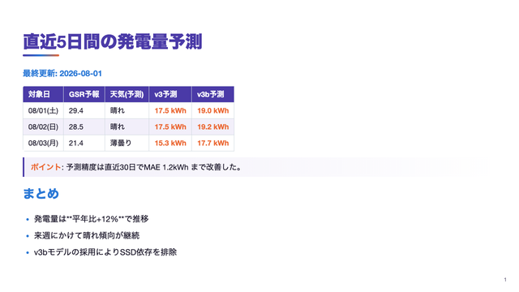

# marp_slides — Markdown → スライド自動生成

> 詳しくは [MANUAL.md](MANUAL.md) を参照  
> VS Code + Marp だけで使う場合は [VSCODE-MARP.md](VSCODE-MARP.md) を参照

Marp を使って Markdown ファイルから PPTX・PDF・HTML を生成するプロジェクト。  
**Claude Code と組み合わせることで、資料の構成・作成・変換をすべて自動化できる。**

---

## ディレクトリ構成

```
marp_slides/
├── README.md                              # このファイル（概要・クイックスタート）
├── MANUAL.md                              # 詳細マニュアル
├── themes/
│   ├── ml-forecast.css                    # カスタムテーマ（パステルカラフル/デフォルト）
│   ├── ml-forecast-multicolor.css         # 配色バリエーション（マルチカラー）
│   ├── ml-forecast-vivid.css              # 配色バリエーション（ビビッドグラデーション）
│   └── samples/                           # 下記デザインパターン集のプレビュー画像
├── templates/
│   ├── template.md                        # 汎用スライドテンプレート
│   └── readme-to-slides.md                # README → 発表スライド変換用テンプレート
└── slides/
    ├── 2026-06-30-ml-forecast.md          # ml_forecast 状況レポート（2026-06-30）
    ├── 2026-06-30-ml-forecast.pdf         # 変換済み PDF
    ├── 2026-06-30-ml-forecast.pptx        # 変換済み PPTX
    ├── 2026-06-ml-forecast.md             # ml_forecast 月次発表スライド（2026-06）
    ├── 2026-06-ml-forecast.pdf
    └── 2026-06-ml-forecast.pptx
```

---

## 使い方のパターン

| パターン | 向いている場面 | 参照先 |
|---------|--------------|--------|
| VS Code + Marp 拡張のみ | CLI 不要・手軽に変換したい | [VSCODE-MARP.md](VSCODE-MARP.md) |
| Marp CLI（npx） | ローカル画像を確実に埋め込みたい・自動化したい | [MANUAL.md](MANUAL.md) |
| Claude Code と連携 | 構成・執筆・変換を一括自動化したい | [MANUAL.md](MANUAL.md) |

### VS Code + Marp 拡張だけで使う場合

CLI インストール不要。VS Code に [Marp for VS Code](https://marketplace.visualstudio.com/items?itemName=marp-team.marp-vscode) 拡張を入れるだけで使い始められる。

- **エクスポート**: `Cmd+Shift+P` → `Marp: Export Slide Deck` で PDF / PPTX を生成
- **カスタムテーマ**: `.vscode/settings.json` に登録済み（`ml-forecast.css` がすぐ使える）
- **スニペット**: `marp` / `marpsec` / `marpend` を入力して `Tab` でテンプレート展開

詳細手順 → [VSCODE-MARP.md](VSCODE-MARP.md)

---

## クイックスタート（CLI）

### パターン A: 汎用テンプレートから作る

```bash
cd /Users/masahiro/projects/marp_slides

# テンプレートをコピー
cp templates/template.md slides/YYYY-MM-DD-タイトル.md

# エディタで編集して変換
npx @marp-team/marp-cli slides/YYYY-MM-DD-タイトル.md \
  --theme themes/ml-forecast.css \
  --pptx -o slides/YYYY-MM-DD-タイトル.pptx \
  --allow-local-files
```

### パターン B: README → スライド変換テンプレートを使う

```bash
# テンプレートをコピー
cp templates/readme-to-slides.md slides/YYYY-MM-DD-プロジェクト名.md

# {{プレースホルダー}} を実際の内容に置き換えて変換
npx @marp-team/marp-cli slides/YYYY-MM-DD-プロジェクト名.md \
  --theme themes/ml-forecast.css \
  --pdf  -o slides/YYYY-MM-DD-プロジェクト名.pdf \
  --allow-local-files
```

### パターン C: Claude Code に一括作成させる（推奨）

```
/Users/masahiro/projects/marp_slides で作業してください。

templates/readme-to-slides.md をベースに、
../../ml_forecast/README.md の内容を
slides/2026-07-01-ml-forecast.md として発表用スライドに再構成してください。

- 1スライド1トピック。発表に適した内容に絞る
- テーマ: themes/ml-forecast.css
- 画像パス: ../../ml_forecast/xxx.png
- 作成後、PDF・PPTX に変換すること
```

---

## テンプレート一覧

### `templates/template.md` — 汎用スライドテンプレート

新規プレゼン作成の骨格。タイトル・セクション区切り・本文・グラフ・まとめの構成を含む。

```
タイトルスライド（濃紺）
  └─ セクション区切り（薄青）
      ├─ 本文スライド
      ├─ 表スライド
      └─ グラフスライド
  └─ セクション区切り（薄青）
      └─ 本文スライド
  └─ まとめスライド（濃紺）
```

### `templates/readme-to-slides.md` — README → 発表スライド変換用テンプレート

プロジェクト README を発表資料に再構成するための雛形。`{{プレースホルダー}}` 形式で置き換え箇所を明示している。

| プレースホルダー | 置き換え内容 |
|----------------|------------|
| `{{プロジェクト名}}` | タイトル・ディレクトリ名 |
| `{{YYYY}}{{MM}}{{DD}}` | 作成日 |
| `{{セクション1タイトル}}` | 発表の大見出し |
| `{{グラフファイル名}}` | 参照する画像のパス |

> Claude Code に「このテンプレートをベースに README を再構成して」と依頼すれば、プレースホルダーを自動で埋めてくれる。

---

## ファイル命名規則

```
YYYY-MM-DD-プロジェクト名.md
```

| ファイル名 | 内容 |
|-----------|------|
| `2026-06-30-ml-forecast.md` | ml_forecast 状況レポート（2026-06-30 作成） |
| `2026-06-ml-forecast.md` | ml_forecast 月次発表（2026-06 作成） |

> 日付を含めることで、同一プロジェクトの月次・日次レポートを時系列管理できる。

---

## デザインパターン集

配色テーマと、表紙・まとめ等の全面色スライド用「ヒーロー背景」は、それぞれ独立に切り替えられる。実際のレンダリング画像は `themes/samples/` に保存済み。

### 配色テーマ（本文全体の配色）

Front Matter の `theme:` 値と、変換コマンドの `--theme` パスを対応するファイルにそろえて切り替える。

| テーマ名（`theme:` の値） | プレビュー | 特徴 |
|---|---|---|
| `ml-forecast`（デフォルト） |  | パステルカラフル。紫・水色・黄色・マゼンダを要素ごとに使い分け、柔らかく上品な印象 |
| `ml-forecast-multicolor` |  | マルチカラー。紫の見出し＋グラデーションテーブルヘッダーで賑やか（見出しは元々グラデーション文字だったが、editable PPTXで崩れるため単色に変更） |
| `ml-forecast-vivid` |  | ビビッドグラデーション。紫基調のシングルアクセントで華やかさと落ち着きの中間 |

```markdown
---
theme: ml-forecast-multicolor   ← CSSの /* @theme */ 名と一致させる
---
```
```bash
--theme themes/ml-forecast-multicolor.css   ← 上と同じテーマのCSSを指定
```

### ヒーロー背景パターン（表紙・まとめ等の全面色スライド用）

`<!-- _class: hero-xxx -->` を指定するだけで切り替えられる（`_backgroundColor` / `_color` の個別指定は不要）。3配色テーマすべてに実装済み。

| クラス名 | プレビュー | 特徴 |
|---|---|---|
| `hero-gradient` |  | メッシュ風の多色グラデーション＋グレイン質感。最も華やか（推奨） |
| `hero-geo` |  | 紺地に控えめな円のあしらい＋グレイン。落ち着きと遊び心の中間 |
| `hero-side` |  | 左42%だけ色ブロック、右は余白。モダンで圧迫感が少ない |
| `hero-diagonal` |  | 斜めのハードエッジで非対称に分割。動きのある印象 |

```markdown
<!-- _class: hero-gradient -->
<!-- _paginate: false -->

# タイトル
```

> **注意**: `--pptx-editable`（LibreOffice経由の編集可能PPTX）は複雑な背景（多重`background-image`・グレイン等）を正しく再構築できず崩れることがある。通常の `--pptx` / `--pdf`（Chromiumスクリーンショット方式）は影響を受けない。対処法は [MANUAL.md](MANUAL.md) の「編集可能な PPTX を作る」を参照。

---

## 画像の埋め込み

変換成功時に PDF・PPTX へ画像が**自動的に埋め込まれる**。別プロジェクトの画像を参照する場合は相対パスで指定する。

```markdown

```

ローカル画像を使う際は `--allow-local-files` が必須。変換後のファイルは単体で配布できる自己完結したファイルになる。

---

## PPTX の編集可否について

通常の `--pptx` オプションで生成した PPTX は、スライド全体を画像として焼き込む方式のため **PowerPoint 上でテキスト編集ができない**。

編集可能な PPTX が必要な場合は、実験的オプション **`--pptx-editable`**（要 `brew install --cask libreoffice`）を使うと、Marp のテーマを保ったまま本物のテキストボックスを持つ PPTX を生成できる。

```bash
npx @marp-team/marp-cli --pptx --pptx-editable \
  -o output.pptx input.md --allow-local-files
```

VS Code 拡張版でも `.vscode/settings.json` の `markdown.marp.pptx.editable` で同等の機能が使える（詳細は [VSCODE-MARP.md](VSCODE-MARP.md)）。

詳しい仕組み・制約・他ツール（ppt_auto / Pandoc）との比較は [MANUAL.md](MANUAL.md) の「PPTX の編集可否について（重要な制約）」を参照。

---

## 関連プロジェクト

| プロジェクト | 関係 |
|------------|------|
| [ml_forecast](../ml_forecast/) | 初出スライドの元プロジェクト |
| [pc_docs](../pc_docs/manuals/automation/marp-slides.md) | pc_docs マニュアル（MANUAL.md と同期） |
| [ppt_auto](../ppt_auto/) | JSON → 定型 PPTX 生成ツール（別アプローチ） |

---

## 更新履歴

| 日付 | 内容 |
|------|------|
| 2026-06-30 | プロジェクト新規作成。ml_forecast/slides からテーマ・スライドを移植 |
| 2026-06-30 | `templates/readme-to-slides.md` を追加。README → スライド変換テンプレートとして整備 |
| 2026-06-30 | `slides/2026-06-30-ml-forecast.md` を作成（README を20スライドに再設計・PDF/PPTX 変換済み） |
| 2026-06-30 | ファイル命名規則を `YYYY-MM-DD-` 形式に統一。テンプレート使用手順を README に追加 |
| 2026-06-30 | `VSCODE-MARP.md` を追加。VS Code + Marp 拡張だけでの PDF/PPTX 生成手順をまとめた |
| 2026-07-01 | MANUAL.md に「PPTX の編集可否について」を追加。Marp の PPTX がテキスト編集不可（画像焼き込み）であることと、編集可能な代替ツール（ppt_auto / Pandoc）との比較表を記載 |
| 2026-07-02 | README.md に「PPTX の編集可否について」セクションを追加。実験的オプション `--pptx-editable`（要 LibreOffice）で編集可能な PPTX が生成できることを記載し、詳細は MANUAL.md を参照する形に整理 |
| 2026-08-01 | 「カスタムテーマ `ml-forecast.css`」セクションを「デザインパターン集」に刷新。配色テーマ3種（`ml-forecast`/`ml-forecast-multicolor`/`ml-forecast-vivid`）とヒーロー背景4種（`hero-gradient`/`hero-geo`/`hero-side`/`hero-diagonal`）を、`themes/samples/` に保存した実レンダリング画像つきで一覧化し、視覚的に選べるようにした |
