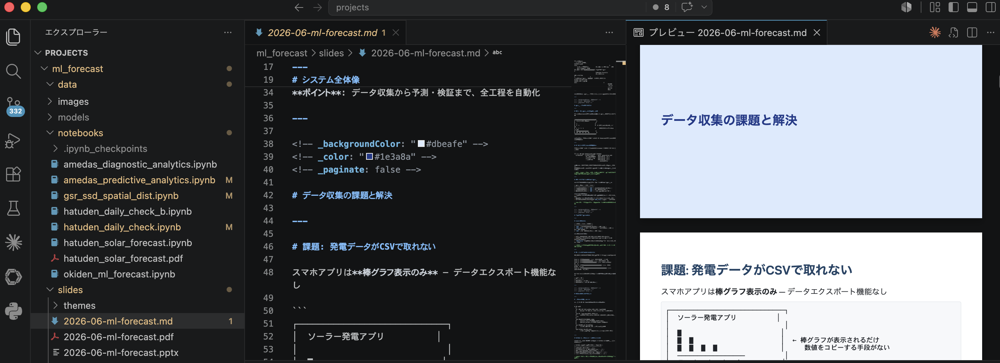

<!-- _backgroundColor: "#1e3a8a" -->
<!-- _color: "#ffffff" -->
<!-- _paginate: false -->

# Marp × Claude Code
## Markdown → スライド自動生成ガイド

2026年6月　

---

# アジェンダ

1. Marp とは
2. セットアップ
3. Markdown の書き方
4. カスタムテーマの作り方
5. 変換コマンド（PPTX / PDF）
6. Claude Code との連携
7. テンプレート活用
8. まとめ

---

<!-- _backgroundColor: "#dbeafe" -->
<!-- _color: "#1e3a8a" -->
<!-- _paginate: false -->

# Marp とは

---

# Marp の概要

**Markdown ファイルをプレゼン資料に変換するツール**

- 通常の Markdown に少しの記法を追加するだけ
- 出力形式: **PPTX / PDF / HTML** の3種類
- VS Code 拡張でリアルタイムプレビュー可能
- CLI で一発変換（インストール不要・`npx` で動作）

> **ポイント**: Markdown を書く感覚でスライドが作れる。デザインはテーマ CSS に任せるだけ。

---

# Marp のワークフロー

| ステップ | 作業 | ツール |
|---------|------|--------|
| ① 構成・執筆 | `.md` ファイルを書く | VS Code / Claude Code |
| ② プレビュー確認 | リアルタイムでスライドを確認 | Marp for VS Code 拡張 |
| ③ 変換 | PPTX / PDF を生成 | Marp CLI（npx） |
| ④ 配布 | 画像・グラフが埋め込まれた単体ファイル | — |

> **ポイント**: 変換後のファイルは画像も含めて**完全自己完結**。単体配布できる。

---

<!-- _backgroundColor: "#dbeafe" -->
<!-- _color: "#1e3a8a" -->
<!-- _paginate: false -->

# セットアップ

---

# セットアップ方法

### VS Code 拡張（プレビュー用）

1. 拡張機能タブで `Marp for VS Code` を検索してインストール
2. `.md` ファイルを開くと右上にプレビューボタンが表示される

### Marp CLI（変換用）

グローバルインストール不要。`npx` でそのまま呼び出せる。

```bash
# バージョン確認（動作確認）
npx @marp-team/marp-cli --version
```

> **ポイント**: 拡張 + CLI の2つだけで完結。Node.js が入っていれば追加インストールは不要。

---

# VS Code プレビュー画面

<!-- style: section { padding: 24px 40px; } -->



左: Markdown ソース、右: Marp リアルタイムプレビュー

---

<!-- _backgroundColor: "#dbeafe" -->
<!-- _color: "#1e3a8a" -->
<!-- _paginate: false -->

# Markdown の書き方

---

# ファイルの基本構造

```markdown
---
marp: true          ← 必須: Marp を有効化
theme: ml-forecast  ← テーマ名（CSS と一致させる）
paginate: true      ← ページ番号を表示
---

# スライド1のタイトル

本文をここに書く

---

# スライド2

`---` でスライドを区切る
```

---

# レイアウト制御

スライドごとのディレクティブは `<!-- -->` コメントで指定。`_` 付きは**そのスライドだけ**に適用。

```markdown
<!-- _backgroundColor: "#1e3a8a" -->  ← 背景色（このスライドのみ）
<!-- _color: "#ffffff" -->             ← 文字色（このスライドのみ）
<!-- _paginate: false -->              ← ページ番号を非表示
```

### 画像の配置

```markdown
          <!-- 全面背景画像 -->
 <!-- 左40%を背景、右にテキスト -->
       <!-- 幅800px でインライン表示 -->
```

---

<!-- _backgroundColor: "#dbeafe" -->
<!-- _color: "#1e3a8a" -->
<!-- _paginate: false -->

# カスタムテーマ

---

# カスタムテーマの作り方

`themes/` ディレクトリに CSS ファイルを作成する。

```css
/* @theme テーマ名 */  ← Front Matter の theme: と一致させる
@import 'default';     ← ベーステーマを継承

:root {
  --color-accent: #2563eb;  /* アクセントカラー */
}

section { font-size: 20px; padding: 48px 56px; }
h1      { color: var(--color-accent); }
th      { background: var(--color-accent); color: #fff; }
```

### 本プロジェクトのテーマ: `ml-forecast.css`

| 要素 | スタイル |
|------|---------|
| タイトル・クロージング | 濃紺 `#1e3a8a` |
| セクション区切り | 薄青 `#dbeafe` |
| アクセント | 青 `#2563eb`（見出し・表ヘッダー） |

---

<!-- _backgroundColor: "#dbeafe" -->
<!-- _color: "#1e3a8a" -->
<!-- _paginate: false -->

# 変換コマンド

---

# PPTX / PDF への変換

```bash
# PDF に変換
npx @marp-team/marp-cli slides/input.md \
  --theme themes/テーマ名.css \
  --pdf -o slides/output.pdf \
  --allow-local-files

# PPTX に変換
npx @marp-team/marp-cli slides/input.md \
  --theme themes/テーマ名.css \
  --pptx -o slides/output.pptx \
  --allow-local-files
```

> **注意**: ローカル画像・カスタムテーマを参照するときは `--allow-local-files` が必須

### 画像の自動埋め込み

変換成功後は画像・グラフが出力ファイルに**完全埋め込み**。単体配布が可能。

---

<!-- _backgroundColor: "#dbeafe" -->
<!-- _color: "#1e3a8a" -->
<!-- _paginate: false -->

# Claude Code との連携

---

# Claude Code が得意な作業

| 作業 | 依頼の仕方 |
|------|-----------|
| スライド構成・執筆 | 「〇〇についてのスライドを作って」 |
| 表の作成 | 箇条書きや CSV を渡すと Markdown テーブルに整形 |
| レイアウト調整 | 「このスライドの文字が多すぎる」と指摘するだけ |
| テーマのカスタマイズ | 「ヘッダーを大きくして」「背景を水色に」 |
| 変換コマンド実行 | 「PDF と PPTX に変換して」と言うだけ |
| 既存スライドへの追記 | 「〇〇のスライドを追加して」 |

> **ポイント**: 内容・デザイン・変換まで**一貫して依頼できる**。

---

# プロンプト例

```
以下の条件で Marp スライドを作成してください。

【対象ファイル】slides/2026-07-report.md
【テーマ】themes/ml-forecast.css（既存カスタムテーマ）
【内容】
  - タイトル: 2026年7月 月次報告
  - セクション1: 先月の実績まとめ（表あり）
  - セクション2: 今月の課題と対応策
  - まとめと次のアクション
【スタイル】
  - セクション区切りは薄青 _backgroundColor "#dbeafe"
  - タイトル・クロージングは濃紺 "#1e3a8a"
```

作成後に「PDF と PPTX に変換して」と続けるだけで変換まで完了。

---

<!-- _backgroundColor: "#dbeafe" -->
<!-- _color: "#1e3a8a" -->
<!-- _paginate: false -->

# テンプレート活用

---

# 用意されているテンプレート

| テンプレート | 用途 |
|------------|------|
| `templates/template.md` | 汎用スライド（タイトル〜まとめまでの骨格） |
| `templates/readme-to-slides.md` | README を発表資料に再構成する雛形 |

### 使い方（パターン A: テンプレートから作る）

```bash
# テンプレートをコピーして編集
cp templates/template.md slides/YYYY-MM-DD-タイトル.md

# 変換
npx @marp-team/marp-cli slides/YYYY-MM-DD-タイトル.md \
  --theme themes/ml-forecast.css \
  --pptx -o slides/YYYY-MM-DD-タイトル.pptx \
  --allow-local-files
```

> Claude Code に「このテンプレートをベースにスライドを作って」と依頼すれば、プレースホルダーを自動で埋めてくれる。

---

<!-- _backgroundColor: "#dbeafe" -->
<!-- _color: "#1e3a8a" -->
<!-- _paginate: false -->

# まとめ

---

# まとめ

**このプレゼンで伝えたこと**

1. Marp は Markdown → PPTX / PDF に変換する軽量ツール
2. VS Code 拡張でリアルタイムプレビュー、CLI で一発変換
3. カスタム CSS テーマでブランドカラーを統一
4. Claude Code との連携で**構成・執筆・変換を完全自動化**
5. テンプレートを使えば新規スライドを素早く作成できる

**今後のアクション**

| やること | 方法 |
|---------|------|
| 新しいスライドを作る | `template.md` をコピーして Claude Code に依頼 |
| テーマをカスタマイズ | `themes/ml-forecast.css` を編集 |
| 既存資料を変換 | README を `readme-to-slides.md` テンプレートで再構成 |

---

<!-- _backgroundColor: "#1e3a8a" -->
<!-- _color: "#ffffff" -->
<!-- _paginate: false -->

# ご清聴ありがとうございました
