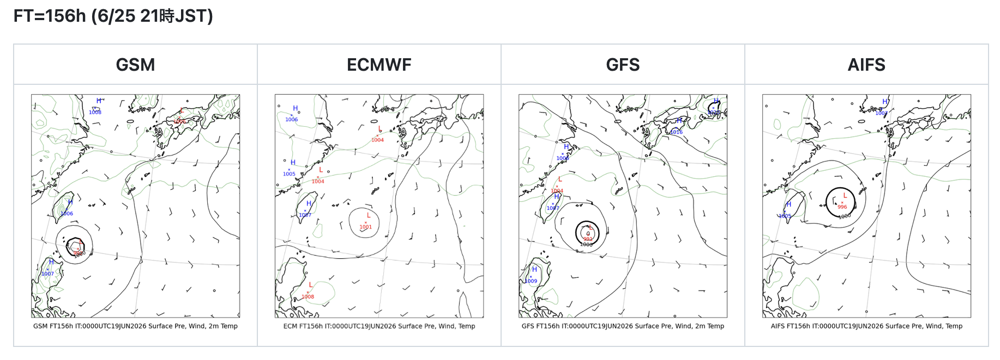
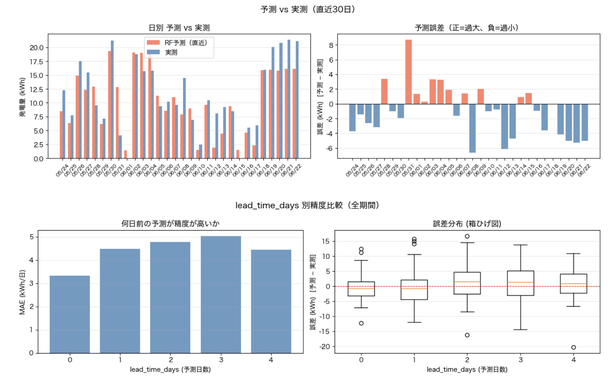

<!-- _backgroundColor: "#1e3a8a" -->
<!-- _color: "#ffffff" -->
<!-- _paginate: false -->

# Claude Code を活用した
# 気象データ分析・予測モデルの開発

## 生成AI活用事例の報告

2026年7月　／　WXBC月例会

---

# 目次

1. 生成AI活用の経緯
2. 開発したプロダクト（気象・予測ツール）
3. 農研機構データ × ml_forecast の取り組み
4. まとめ・今後の展開

---

# 生成AI活用から Claude Code による開発へ

- 約2年前より生成AIを利用したコード作成を開始。チャットベースでWebアプリの試作を実施
- その後 AI エージェントの活用方法を知り、CLAUDE.md・plan.md を用いた Claude Code での開発フローを導入
- チャットでの要件整理 → GitHub への push → ドキュメント化、という一連の流れを反復
- 半年間で **34件** のリポジトリを作成

> 天気図・発電量予測・電力データ分析・ローカルLLM比較など、実用ニーズに応じてテーマを設定

---

# チャットでの開発 vs Claude Code（AIエージェント）

---

# 学習教材と参考資料

- WXBC「気象データ分析チャレンジ」にて Python・気象データの取り扱い・機械学習の基礎を習得
- 同講座を通じて**農研機構メッシュ農業気象データ（AMD）**の存在を確認
- 黒良氏の Note 連載記事を参考に GRIB2 データの読み込み処理を実装
- 公開されている教材コードをベースに、Claude Code で機能追加・改修を実施

> 教材・サンプルコードを土台として、Claude Code と共に機能を拡張していく開発スタイル

---

<!-- _backgroundColor: "#dbeafe" -->
<!-- _color: "#1e3a8a" -->
<!-- _paginate: false -->

# 開発したプロダクト

---

# 4気象モデルによる進路予測の比較

GSM（気象庁）・ECMWF（欧州中期予報センター）・GFS（米国）・AIFS（ECMWF AI予測）による地上気圧予報を並列表示。
例: 2026年6月19日00UTC初期値、156時間予報（6/25 21時JST時点）。

> GSM を含む4モデル比較表示は独自開発。台風接近時の進路確認に活用している

---

# 気象レーダー・衛星画像表示アプリ

- 公開されている実装を Claude Code に読み込ませ、機能単位に分割したアプリを開発
- Web アプリ・iOS アプリ・Android アプリを実装（現時点では非公開）
- 既存の実装を参考に AI で機能を移植・改修する開発手法を採用

公開URL: https://masauehr.github.io/iphone-weather-app/radar

---

<!-- _backgroundColor: "#dbeafe" -->
<!-- _color: "#1e3a8a" -->
<!-- _paginate: false -->

# 農研機構データ × ml_forecast の取り組み

---

# 農業気象データによる太陽光発電量予測

- 農研機構メッシュ農業気象データ（AMD）: 全国をメッシュ単位で網羅する気象データ
- WXBC「アメダス解析チャレンジ」の公開コードを参考にモデルを構築
- 説明変数: 全天日射量・日照時間等の気象予報値／目的変数: 実測発電量
- 手法: **Random Forest**。毎朝6:30に予測を自動更新し、GitHub で結果を公開・検証

---

# ml_forecast — 自宅太陽光発電量 機械学習予測

農研機構AMD（メッシュ農業気象データ）のGSR・GSR/平年比・SSDを説明変数に、自宅の日別太陽光発電量（kWh）をRandom Forestで予測。

### 直近5日間の発電量予測（最終更新: 2026-07-05）

| 日付 | GSR | 平年比 | SSD | 天気 | v3 | v3b |
|---|---|---|---|---|---|---|
| 07/05(日) | 30.4 | 1.48 | 7.3 | 晴れ | 18.4 | 19.3 |
| 07/06(月) | 32.4 | 1.59 | 7.3 | 晴れ | 18.5 | 20.1 |
| 07/07(火) | 24.1 | 1.18 | 5.5 | 晴れ | 16.8 | 18.2 |
| 07/08(水) | 21.4 | 1.05 | 5.5 | 晴れ | 16.4 | 17.2 |
| 07/09(木) | 22.3 | 1.10 | 5.5 | 晴れ | 16.8 | 18.1 |

単位: GSR(MJ/m²)・SSD(h)・v3/v3b(kWh)　モデル: Random Forest v3（CV MAE=2.09 kWh/日）

> 精度評価は継続中。日次での予測・検証サイクルを運用している

---

# 運用を通じた説明変数の見直し

- 初期モデルは説明変数の選定を含めて生成AIに一任し、一定の精度を確保
- 運用開始から約1ヶ月後、予測値に異常が見られたため要因を調査
- 5日前の日射量やその移動平均など、妥当性の低い説明変数が含まれていたことが判明
- 説明変数を見直し、モデルを再構築

> 発電量予測は蓄電池の夜間充電判断にも活用。晴天予測時は太陽光発電を優先し、悪天候予測時は夜間電力で充電

---

<!-- _backgroundColor: "#1e3a8a" -->
<!-- _color: "#ffffff" -->
<!-- _paginate: false -->

# まとめ・今後の展開

- 開発中の各ツールは、運用しながら継続的に改善を実施
- ローカルLLM比較・電力データ分析についても並行して取り組み中
- 今後の課題: 撮影した地衣類（コケ類）画像の自動分類手法の検討

以上
