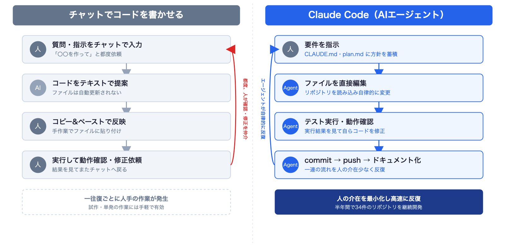
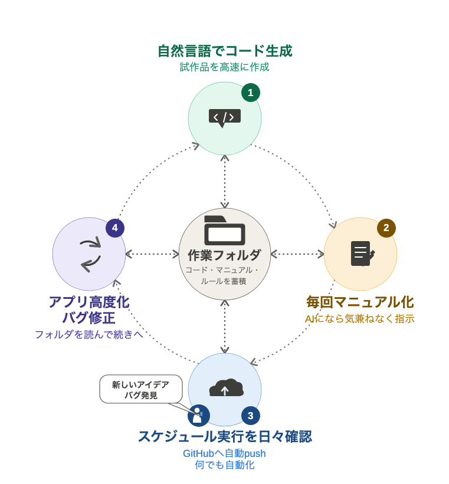

# 気象データ×生成AI ― バイブコーディング実践記

**上原政博（沖縄気象台／WXBC 個人会員）**

沖縄情報「コーヒーブレイクコーナー」寄稿　原稿案（2026年9月）
※ 7月の WXBC 気象×IT 提供会での発表内容をもとに、9月の WXBC 人材育成WG 全体会合向けに整理したものです。

---

## はじめに

沖縄情報には若手職員による自由投稿コーナー「コーヒーブレイクコーナー」があります。歴戦を迎える私も、担当業務を離れた自由な話題を書いてみたいと思います。ちょっと年季の入った「シニアコーラル」ですが（笑）。

今年はデジタル庁の「準備」利用開始や Microsoft 365 Copilot の利用拡大もあり、気象庁にとって生成AI活用が本格化する年と言えるのではないでしょうか。

私自身は2024年から生成AIの利用を始め、主にプログラミングや業務効率化への応用に取り組んできました。当初は個人的な試行錯誤から始まりましたが、その楽しさや有用性を共有したいと思い、有志による「Python_AI グループ」を立ち上げました。現在は沖縄管内だけでなく本庁や他管区にも活動が広がり、40名を超えるメンバーが情報交換を続けています。SharePoint サイトなどを通じて活用事例やノウハウの共有も行っています（活動履歴の詳細は個人ページに掲載しています）。

また今年6月には気象ビジネス推進コンソーシアム（WXBC）の個人会員となり、人材育成ワーキンググループの活動に参加しています。WXBC での学びは、その後の AI 活用やプログラミングの幅を大きく広げるきっかけになりました。

## 本稿の内容

本稿では、次の5つについて紹介します。

1. 生成AI活用の経緯
2. 開発したプロダクト（気象・予測ツール）
3. 農研機構メッシュ農業気象データ × AI による機械学習の取り組み
4. バイブコーディングとは
5. まとめ・今後の展開

---

## 1. 生成AI活用の経緯 ― ChatGPT から Claude Code へ

生成AIを使ったコード作成を始めたのは約2年前です。ChatGPT を相手に、チャット形式で Web アプリの試作を繰り返していました。

その後、WXBC「アメダス気象データ分析チャレンジ」を受講し、Python・機械学習・気象データの扱い方を学びました。この経験が大きな転機になりました。

さらに AI エージェントという開発スタイルを知り、今年3月から Claude Code を活用するようになりました。面倒な作業を AI に任せ、自分はアイデアや改善に集中できるようになったことで、開発スピードは大きく向上しました。

現在では、天気図作成、太陽光発電量予測、電力データ分析、ローカル LLM の検証など、失敗したものも含めて55件のプロジェクトを試し、GitHub のリポジトリに記録しています。

### チャットでの開発と Claude Code（AI エージェント）の違い

チャットによる開発では、毎回状況を説明し、プロンプトで指示を出し、コードを貼り付けてから作業を再開しなければなりません。一往復ごとに人手の作業（コピー＆ペースト、動作確認、修正依頼）が挟まります。

Claude Code では、プロンプトに相当する Markdown ファイルを常に読み込ませた状態で起動します。コードは git で管理し、コードとドキュメントを GitHub に保存します。要件を指示したあとは、ファイル編集・テスト実行・commit／push まで、人の介在を最小化して反復してくれます。スマホからドキュメントを確認したり、毎日の自動処理が出力したグラフを見たりできるようにもなりました。

{width=95%}

具体的な使い方は次のとおりです。

- 作業フォルダに Markdown ファイル（`CLAUDE.md`、`plan.md` など）を置き、制限事項（セキュリティ）や開発方針を AI に読ませてから開発を始める
- チャットで指示を出すと、AI が直接 Python コードを書いてファイルに保存する（タイプミスもない）
- チャットのやり取り（バグ取り・機能追加・Q＆A）は常にまとめさせてマニュアル化する
- AI が作成したコードとドキュメントを GitHub へ push する。この流れを反復して改良していく

{width=70%}

---

## 2. 開発したプロダクト（気象・予測ツール）

### 5気象モデルによる台風進路予測の比較

GSM（気象庁）、ECMWF（欧州中期予報センター）、GFS（米国）、AIFS（ECMWF の AI モデル）など複数モデルの予想天気図を並列表示するツールです。台風接近時の進路変化やモデル差の確認に利用しています。GSM を含む5モデルの比較表示は独自開発で、スクリプトは GitHub で公開しています。

{width=95%}

### レーダー・衛星画像アプリ、潮位観測アプリ

気象情報表示 Web アプリのコードを Claude Code に読み込ませ、機能単位に分割したサンプルアプリ集を作りました。単機能のコードを AI に読ませて簡単なアプリを作り、そこから機能を追加したりバグを取ったりします。既存の実装を参考に、AI でコードを理解・移植・改修していく事例です。

Web アプリ・iOS アプリ・Android アプリを同時に実装しました（Expo Go を利用。現時点では Web アプリのみ公開）。気象庁の検潮所データをリアルタイム表示する潮位観測アプリも、同じ手法で開発しています。

- レーダー・衛星画像アプリ: <https://masauehr.github.io/iphone-weather-app/radar>
- 潮位観測アプリ: <https://masauehr.github.io/tide_viewer/>

{width=45%}

{width=45%}

### 気象庁データ取得 MCP サーバー（jma-mcp）

気象庁の防災情報サイト（bosai.jma.go.jp）が内部で使用しているデータを AI と一緒に解析し、AI から自然言語で利用できるようにしたものです。天気予報・警報／注意報・早期注意情報・観測ランキング・潮位など、計21種類のツールを実装しています。HTTP/SSE 版を Render にデプロイしており、Claude.ai の Web 版・デスクトップアプリ・iPhone 版からも利用できます。

- GitHub: <https://github.com/masauehr/jma-mcp>

「東京の週間天気予報は？」「那覇の現在の潮位を教えて」のように質問するだけで、AI が自動的にツールを呼び出し、最新データを取得します。

> **MCP（Model Context Protocol）とは**: Anthropic が策定したオープン標準プロトコル。AI と外部ツール・データソースを接続する仕組みで、AI が学習データにない最新情報やローカル環境の情報をリアルタイムに取得できるようになる。

---

## 3. 農研機構メッシュ農業気象データ × AI による機械学習の取り組み

### 取り組みのきっかけ

WXBC「アメダス気象データ分析チャレンジ」で、気象データ（気温など）から東京電力の電力消費量をニューラルネットワークで予測する演習に取り組みました。気温だけの単回帰では R²=0.03 とほぼ無相関でしたが、複数の気象・時刻要素を使ったニューラルネットワークでは R²=0.87 まで精度が向上しました。

この「気象データ（説明変数）→ 電力消費量（目的変数）」という構造を、自宅の太陽光発電にも応用できないかと考えました。チャレンジで学んだ手法をベースに、農研機構メッシュ農業気象データを使った独自モデルの開発に着手します。これが自宅太陽光発電量予測モデル `ml_forecast` の出発点です。

{width=60%}

{width=55%}

### 教師データ（太陽光発電量）の取得を AI で解決

機械学習で重要なのは、教師データをどれだけ用意できるかです。ところが、自宅の太陽光発電では、アプリに月次の棒グラフしか表示されず、日別のデータを CSV で取り出すことができませんでした。

そこで、太陽光発電アプリの月次棒グラフのスクリーンショットを画像処理で自動解析し、教師データとなる日別発電量を抽出する仕組みを作りました（`extract_hatuden_daily.py`）。

- 緑色のバー（発電量）をピクセル色で検出し、バーの高さから数値化する
- アプリが表示する月次合計値でスケーリングし、目標値との誤差 ±0.03 kWh 以内に補正する
- 手入力で発電量を追加するアプリ（Jupyter Notebook）も作り、日々の精度検証に使う

スクリーンショットを撮るだけで教師データが増えます。手入力なしで学習データを日々蓄積できるのが利点です。

{width=65%}

### 農業気象データによる太陽光発電量予測

農研機構メッシュ農業気象データシステム（AMGSDS）は、全国をメッシュ単位で網羅する気象データです。WXBC「アメダス気象データ分析チャレンジ」の公開コードを参考にモデルを構築しました。説明変数は全天日射量・日照時間などの気象予報値、目的変数は実測発電量です。毎朝6:30に予測を自動更新し、結果は GitHub で確認しています。

| モデル | R²（OOF） | MAE（kWh/日） |
|---|---|---|
| **Random Forest** | **0.846** | **1.89** |
| Gradient Boosting | 0.840 | 1.93 |
| Ridge 回帰 | 0.813 | 2.14 |

複数モデルを比較検討し、精度が最も高い Random Forest を現行モデルに採用しました。

{width=55%}

### ml_forecast ― 自宅太陽光発電量 機械学習予測

AMGSDS の GSR・GSR/平年比・SSD（日照時間）を説明変数に、自宅の日別太陽光発電量（kWh）を Random Forest で予測しています。

| 日付 | GSR | 平年比 | SSD | 天気 | v3 | v3b |
|---|---|---|---|---|---|---|
| 07/05(日) | 30.4 | 1.48 | 7.3 | 晴れ | 18.4 | 19.3 |
| 07/06(月) | 32.4 | 1.59 | 7.3 | 晴れ | 18.5 | 20.1 |
| 07/07(火) | 24.1 | 1.18 | 5.5 | 晴れ | 16.8 | 18.2 |
| 07/08(水) | 21.4 | 1.05 | 5.5 | 晴れ | 16.4 | 17.2 |
| 07/09(木) | 22.3 | 1.10 | 5.5 | 晴れ | 16.8 | 18.1 |

単位: GSR（MJ/m²）・SSD（h）・v3/v3b（kWh）　モデル: Random Forest v3（CV MAE=2.09 kWh/日）。日次で予測・検証のサイクルを運用しています。

{width=75%}

### 運用を通じた説明変数の見直し

初期モデルは、説明変数の選定を含めて生成AIに一任し、一定の精度を確保しました。ところが運用開始から約1ヶ月後、予測値に異常が見られたため要因を調査したところ、5日前の日射量やその移動平均など、妥当性の低い説明変数が含まれていたことが判明しました。そこで説明変数を見直し、モデルを再構築しています。

| バージョン | 期間 | 説明変数 | CV MAE |
|---|---|---|---|
| v1 | 〜2026-05-17 | 8変数（GSR・TMP_max・月 sin/cos・GSR_5day_avg 等） | — |
| v2 | 2026-05-18〜06-06 | 6変数（GSR・GSR_ratio・TMP_max 等） | 2.23 kWh |
| **v3** | **2026-06-07〜** | **3変数（GSR・GSR_ratio・SSD）** | **2.08 kWh** |
| v3b | 2026-06-23〜 | 2変数（GSR・GSR_ratio、SSD 除外） | 2.22 kWh |

変数を絞り込むたびに精度が向上しました（CV MAE 2.23→2.08 kWh）。現在は v3／v3b を並行稼働させ、晴れ日に過小評価されがちな SSD 予報の影響を検証しています。

発電量予測は蓄電池の充電判断にも活用しています（晴天時は太陽光優先、悪天候時は夜間電力）。個人宅では不要でも、大規模な太陽光＋蓄電池の運用では有効だと考えています。

---

## コラム① 歴戦からのプログラミング再入門

私は決してプログラマーではありません。

気象庁に入庁した頃は、ようやく個人でパソコンを購入できるようになった時代でした（まだインターネットはなく、パソコン通信の時代です）。採用後の北大東島地方気象台で C 言語を学び、その後、予報課勤務時代には沿岸波浪モデルの波高を表示するアプリケーションを作成したこともあります。

けれども、その後は既存プログラムや VBA マクロを少し修正する程度で、本格的なプログラミングからは遠ざかっていました。JAVA などにも挑戦しましたが続かず、「プログラミングは好きだけど得意ではない」という状態が長く続いていました。

そんな私が再びプログラミングに熱中するようになったのは、生成AIとの出会いがきっかけです。

以前ならエラーや技術的な壁にぶつかるたびに手が止まっていましたが、今は AI と対話しながら一つずつ解決できます。歴戦を迎えていても、これほど多くのアプリや自動化ツールを作れるようになるとは想像していませんでした。

生成AIは単なる業務効率化ツールではなく、私にとっては、若い頃に途中で諦めたものづくりへの再挑戦を可能にしてくれる存在でした。

---

## コラム② 私が Claude Code に驚いた日

生成AIによるプログラミングを始めた当初は、ChatGPT とのチャットだけでも十分に衝撃的でした。

コードを書いてもらい、エラーを貼り付けて修正してもらう。それだけで、以前とは比較にならないスピードで開発が進みました。

ところが今年、AI エージェント型の開発環境を使い始めて、さらに大きな衝撃を受けました（最初は OpenAI の Codex などを試し、その後 Claude Code に落ち着きました）。

最初は「チャットが少し便利になる程度だろう」と考えていました。しかし実際には全く違いました。AI がコードを書き、ファイルを修正し、テストを実行し、ドキュメントを更新し、GitHub へ反映するところまで支援してくれます。

気付けば、コードを一行ずつ考える時間よりも、「何を作りたいのか」「どのような機能が必要か」を考える時間の方が長くなっていました。

もちろん AI も間違えます。最終的な判断は人間が行う必要があります。けれども、これまで技術的な壁に阻まれて実現できなかったアイデアが、試作品として形にできるようになったことは大きな変化でした。

- 「気象庁のデータをもっと見たい・表示できないか」
- 「スマートフォンで使いたい気象アプリを作れないか」
- 「気象データから発電量を予測できないか」

そんな思いつきを、気軽に形にして試せるようになりました。

最近では、プログラミングというより、AI との協働作業に近い感覚になっています。そして、この開発スタイルを表現する言葉として、私は「バイブコーディング」がしっくりくると感じています。

---

## 4. バイブコーディングとは

### 「vibe coding」という言葉の由来

2025年2月、AI 研究者のアンドレイ・カルパシー氏（元 Tesla AI 責任者・OpenAI 共同創業者）が X で提唱した言葉です。日本では通常そのまま「バイブコーディング」と呼ばれます。「vibe」は「雰囲気」や「ノリ」を意味し、「ノリで開発する」と説明されることもあります。

> "There's a new kind of coding I call **'vibe coding'**, where you fully give in to the vibes, embrace exponentials, and forget that the code even exists. [...] It's not too bad for throwaway weekend projects."
> — Andrej Karpathy (2025/2/2)

提唱者本人が「使い捨ての週末プロジェクト向け」と明言しており、当初は個人プロジェクトを念頭に置いたスタイルとして紹介されました。コードを一行ずつ書くのではなく、**見て・言って・動かして・貼り付ける**を繰り返し、アイデアを素早く形にするのが得意です。業務知識をもつ人が自らツールを試作しやすくなったことから個人開発と相性が良く、企業でも試作品づくりや社内ツール開発、アイデアの検証に活用されています（利用者向けに使うには、人によるテストや改善が必要です）。

### 私の開発スタイル

作業フォルダにコードとマニュアルを蓄積しながら開発するスタイルが定着しました。GitHub へ自動 push し、定時実行の結果をスマホから日々確認して、気づきを次の開発に活かします。フォルダに蓄積されたコードとマニュアルを AI が読むので、「続きから」で開発を再開できます。

{width=55%}

- **なぜ毎回プロンプトを入力し直さなくてよいのか**: コード・マニュアル・ルールを作業フォルダに置いておくと、次回の作業継続時に AI が自動で読み込む。経緯を説明し直さず「続きから」で再開できる
- **GitHub で閲覧するもの**: コードそのものというより、自動化処理した成果物（Web アプリ・記事・グラフ・検証結果など）を見える化したもの
- **バイブコーディングとしての強み**: 試作品の高速開発に向く。コードの知識がなくても自然言語の指示だけで形にでき、「動くもの」を作りながら学べる

このプレゼン資料自体もバイブコーディングで自動作成しました。ただし、学習が目的なら、AI に解説させながら開発を進める方が向いています。

参考: 「[Claude Code ですべての日常業務を爆速化しよう！](https://qiita.com/minorun365/items/114f53def8cb0db60f47)」（@minorun365, Qiita）― Claude Code を使い始めた際の最初の参考資料。

---

## 5. まとめ・今後の展開

- バイブコーディングは、専門的なプログラミング知識がなくてもアイデアを形にできる開発スタイルです。
- 気象データは公開性が高く、AI 活用やデータ分析の学習素材として優れています。
- WXBC の教材と生成AIを組み合わせることで、気象データ活用と機械学習を同時に学ぶことができます。
- 開発したツールは運用しながら改善を続けています。
- 今後は太陽光発電予測、電力データ分析、気象データ活用、ローカル LLM、情報収集の自動化などの分野に取り組んでいきたいと考えています。

生成AIの登場によって、「プログラムを書ける人」と「書けない人」の境界は以前より低くなったように感じています。私自身も、若い頃に挫折したプログラミングを、歴戦を迎えて再び楽しめるようになりました。

もし本稿を読んで少しでも興味を持った方がいれば、ぜひ AI に話しかけながら、小さな自動化やアプリ作りから始めてみてください。思った以上に、新しい世界が開けるかもしれません。

---

## コラム③ 日曜プログラマーの余談

今回報告した生成AIによるプログラミングは、直接業務と関係したものではなく、あくまで「日曜プログラマー」としての取り組みです。

今年の旧盆、家でパソコンを開いてプログラミングをしながら来客を待っていたときのことです。訪ねてきた兄が、開いたままのノートパソコンを見て「仕事していたのか？」と言いました。そのときは意外に思えて、「パソコンは仕事以外でも使うでしょう」と感じたのですが、あとで考えると、休みの日に家でパソコンを開いて何かをするのは、あまり一般的ではないのかもしれない、と軽い衝撃を受けました。

そういえば以前、同僚の本職のプログラマーが「家ではパソコンを開かない」と話していたのを思い出しました。

私の生成AIによるバイブコーディングの話は、休日にパソコンを開くような、少しマニアックな人向けの話なのかもしれません。ただ、その入口は以前よりずっと広くなっています。気象データに興味があれば、まずは軽い気持ちでのぞいてみてください。

以上
