<!-- _class: hero-gradient -->
<!-- _paginate: false -->

# 気象データ×生成AI
# ― バイブコーディング実践記 ー

## 生成AI活用事例の報告

2026年9月18日　／　WXBC 人材育成WG全体会合　話題提供

上原政博（沖縄気象台　WXBC個人会員）

---

# 概要

プログラミングを少しかじった程度で開発の専門知識のない私ですが、WXBCの「アメダス気象データ分析チャレンジ」でPythonと機械学習を初めて学び、同時期に始めた生成AIによるプログラミングを組み合わせることで、新たな世界が広がっています。

AIと対話しながらアプリ開発を進める「バイブコーディング（Vibe Coding）」というスタイルで、プログラミング（手抜きですが）の楽しさを知り、今年3月から生成AIエージェントのClaude Codeを使い始めてからは、面倒な「作業」を減らして、アイデアを形にする高速開発のサイクルが定着しました。

今回は、この開発スタイルの紹介と、農研機構メッシュ農業気象データを活用した太陽光発電量予測の機械学習事例を紹介します。

---

# 目次

1. 生成AI活用の経緯
2. 開発したプロダクト（気象・予測ツール）
3. 農研機構メッシュ農業気象データ × AIによる機械学習の取り組み
4. バイブコーディングとは
5. まとめ・今後の展開

---

# 生成AI活用から Claude Code による開発へ

- 約2年前より生成AI（Chat GPT）を利用したコード作成を開始。チャットベースでWebアプリの試作を実施
- WXBCのアメダス気象データ分析チャレンジ受講により、pythonと機械学習、気象データの扱い方を学ぶ
- その後 AI エージェントの活用方法を知り、今年3月からClaude Code での開発を開始
- 何でも自動化を合言葉に、日常の電気料金のwebサイトでの確認などを自動化（自動データ取得・グラフ化・見える化しwebへ）
- AIへのチャットによる指示でコード自動修正・ドキュメント化 → GitHub への push という一連の流れを反復し、改良していく

> 天気図・発電量予測・電力データ分析・ローカルLLM比較など、実用ニーズに応じてテーマを設定

---

# チャットでの開発 vs Claude Code（AIエージェント）

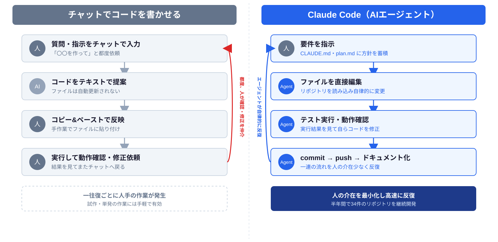

---

# Claude Code の具体的な使い方

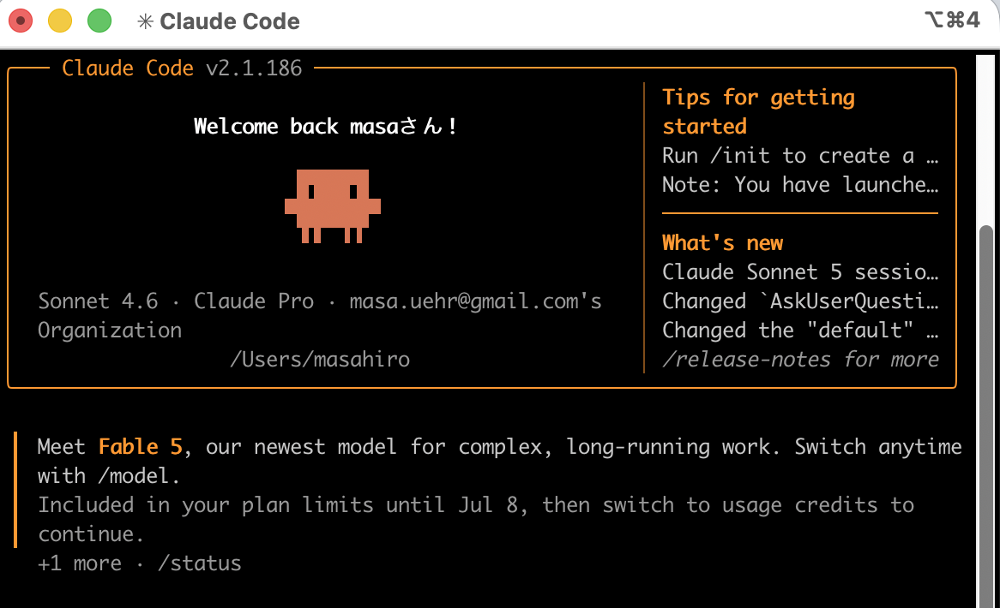

- フォルダにマークダウンファイルを保存（CLAUDE.md、plan.mdなど）し、AIに制限事項（セキュリティ）や方針を読ませて開発
- チャットで指示を出しAIが直接pythonコードを書いて保存（タイプミスもない）
- チャットの内容（バグ取り、機能追加、Q＆A）を常時まとめさせてマニュアル化　← チャットだと自分でやる（面倒）が、AI頼みだと簡単
- AI作成のpythonコード・ドキュメント → GitHub への push という一連の流れを反復し、改良していく

> チャットによる開発では継続的・安定的な開発が難しい。毎回説明し、プロンプトで指示し、コードを貼り付けて作業再開しなければならない。
> Claude Codeでは、プロンプトに当たるマークダウンファイルを常に読み込ませて起動し、コードもgitで管理、GitHubにコードとドキュメントを保存することで、スマホでドキュメント確認や毎日の自動処理の結果のグラフなどを見ることができる。

---

# AIへサンプルアプリを読ませて開発（応用、高機能化）

- WXBC「気象データ分析チャレンジ」にて Python・気象データの取り扱い・機械学習の基礎を習得
- 同講座を通じて**農研機構メッシュ農業気象データシステム（AMGSDS）**の存在を確認
- 黒良氏の Note 連載記事を参考に GRIB2 データの読み込み処理と天気図作成スクリプトを実装
- 気象台職員のwebアプリのコード（javascript）をAIに読ませて、webアプリを作成（コード変換も簡単 python<->javascript）
- 公開されている教材コードをベースに、Claude Code で機能追加・改修を実施

> 教材・サンプルコードを土台として、Claude Code と共に機能を拡張していく開発スタイル

---

<!-- _backgroundColor: "#dbeafe" -->
<!-- _color: "#1e3a8a" -->
<!-- _paginate: false -->

# 開発したプロダクト

---

# 5気象モデルによる進路予測の比較

GSM（気象庁）ECMWF（欧州中期予報センター）GFS（米国）AIFS,AIFS-ENS（ECMWF AI予測）による地上気圧予報を並列表示。
例: FT=132h予報（7/10 9時JST時点）。

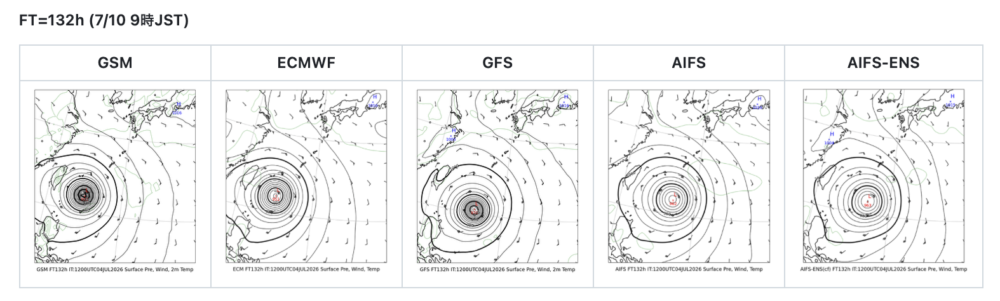

> GSM を含む5モデル比較表示は独自開発。台風接近時の進路確認に活用している。
> カラー版天気図や極天気図、5日平均、エマグラム、断面図など、高度な天気図作成も可能でGitHubでスクリプトを公開

---

# 衛星画像・レーダー表示アプリ、潮位観測表示アプリを開発

- 気象情報表示webアプリのコードを Claude Code に読み込ませ、機能単位に分割したサンプルアプリ集を作成
- 単機能のコードをAIに読ませて、簡単なアプリを作成し、AIで機能を追加したりバグ取りを行う
- Web アプリ・iOS アプリ・Android アプリを同時実装（Expo Goを利用、現時点ではwebアプリのみ公開）
- 既存の実装を参考に AI で機能を移植・改修する開発手法を採用
- 気象庁の検潮所データをリアルタイム表示する潮位観測アプリも同様の手法で開発

公開URL: https://masauehr.github.io/iphone-weather-app/radar
公開URL: https://masauehr.github.io/tide_viewer/

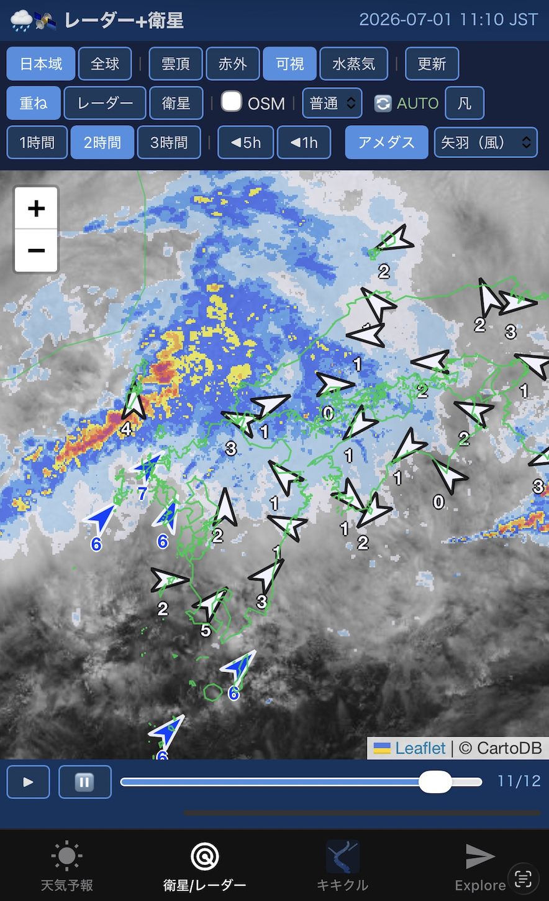
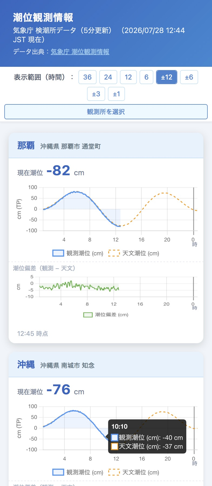

---

# 気象庁データ取得 MCPサーバー（jma-mcp）

- 気象庁サイト（bosai.jma.go.jp）が内部で使用する非公開API（認証不要）をAIと解析し、MCPサーバーとして実装
- 天気予報・警報／注意報・早期注意情報・観測ランキング・潮位など計21種のツールを提供
- HTTP/SSE版（jma-mcp-remote）をRenderにデプロイし、Claude.ai Web版・デスクトップアプリ・iPhone版からも利用可能

GitHub: https://github.com/masauehr/jma-mcp

> 気象庁HPからのデータ取得コードは、以降の別アプリ（検潮所観測データ一覧表示等）作成でAIが参考にできるので開発高速化になる

**Claude Code へ自然言語で質問するだけで自動的にツールを呼び出し、最新データを取得**

> 「東京の週間天気予報は？」
> 「沖縄への早期注意情報を教えて」
> 「那覇の現在の潮位を教えて」
> 「今日の全国降水量ランキングを見せて」

**MCP（Model Context Protocol）とは**: Anthropicが策定したオープン標準プロトコル。AI（Claude）と外部ツール・データソースを接続する仕組みで、これによりAIが学習データにない最新情報やローカル環境の情報をリアルタイムに取得できるようになる。

---

<!-- _backgroundColor: "#dbeafe" -->
<!-- _color: "#1e3a8a" -->
<!-- _paginate: false -->

# 農研機構メッシュ農業気象データ × AIによる機械学習の取り組み

---

# 取り組みのきっかけ

- WXBC「アメダス気象データ分析チャレンジ」で、気象データ（気温等）から東京電力の電力消費量をニューラルネットワークで予測する演習に取り組んだ
- 気温だけの単回帰では R²=0.03 とほぼ無相関だったが、複数の気象・時刻要素を使ったニューラルネットワークでは R²=0.87 まで精度が向上
- **気象データ（説明変数）→ 電力消費量（目的変数）という構造を、自宅の太陽光発電にも応用できないかと着想**
- チャレンジで学んだ手法をベースに、農研機構メッシュ農業気象データを使った独自モデルの開発に着手

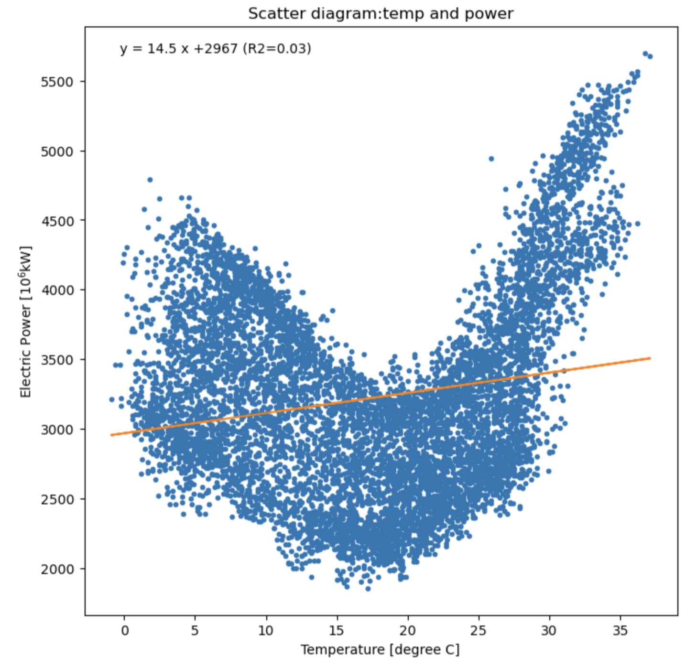
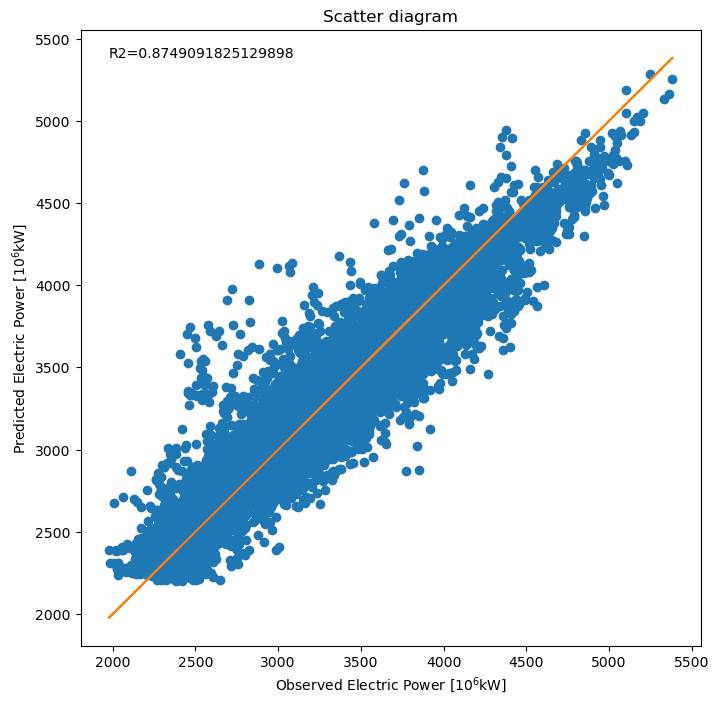

WXBC「アメダス気象データ分析チャレンジ」教材より　左: 気温と電力消費量の単回帰（R²=0.03）　右: ニューラルネットワークによる予測値と実測値の散布図（R²=0.87）

> 教材で学んだ手法を、自分の生活に身近な太陽光発電というテーマに転用したのが ml_forecast の出発点

---

# 教師データ（太陽光発電量）の取得をAIで解決

太陽光発電アプリの月次棒グラフのスクリーンショットを画像処理で自動解析し、教師データとなる日別発電量を抽出（`extract_hatuden_daily.py`）。

- 緑色のバー（発電量）をピクセル色で検出し、バーの高さから数値化
- アプリが表示する月次合計値でスケーリングし、目標値との誤差 ±0.03 kWh 以内に補正
- 画像データから発電量を読み取る仕組みと手入力で発電量を追加するアプリ（Jupyter Notebook）を作成し、日々の精度検証にも活用

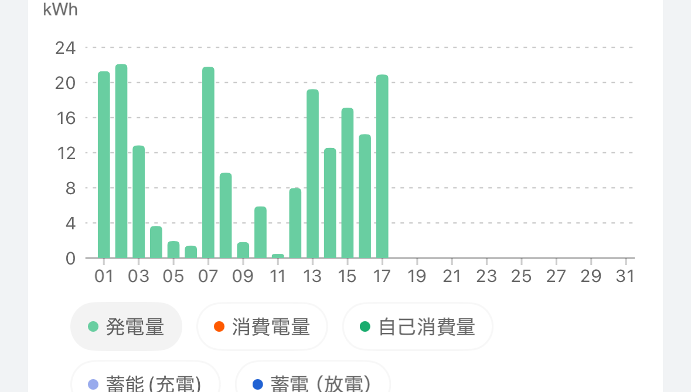

> スクリーンショットを撮るだけで教師データが増える。手入力なしで学習データを日々蓄積できる

---

# 農業気象データによる太陽光発電量予測

- 農研機構メッシュ農業気象データシステム（AMGSDS）: 全国をメッシュ単位で網羅する気象データ
- WXBC「アメダス気象データ分析チャレンジ」の公開コードを参考にモデルを構築
- 説明変数: 全天日射量・日照時間等の気象予報値／目的変数: 実測発電量
- 毎朝6:30に予測を自動更新し、GitHub で結果を確認

| モデル | R²（OOF） | MAE (kWh/日) |
|---|---|---|
| **Random Forest** | **0.846** | **1.89** |
| Gradient Boosting | 0.840 | 1.93 |
| Ridge 回帰 | 0.813 | 2.14 |

**→ 複数モデルを比較検討し、精度が最も高い Random Forest を現行モデルに採用**

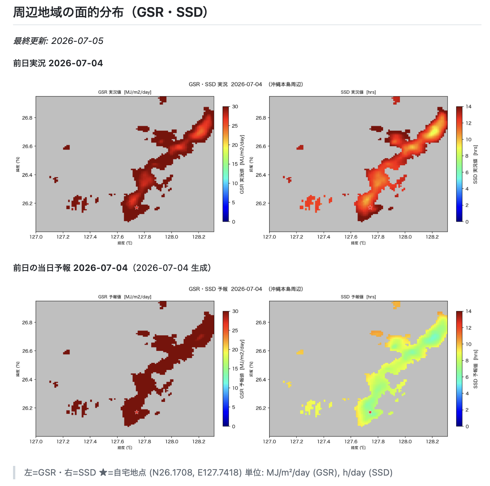
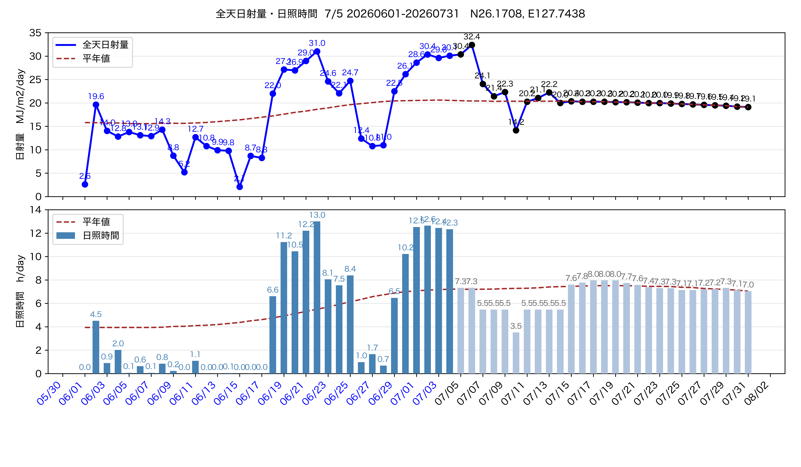

---

# ml_forecast — 自宅太陽光発電量 機械学習予測

農研機構メッシュ農業気象データシステム（AMGSDS）のGSR・GSR/平年比・SSDを説明変数に、自宅の日別太陽光発電量（kWh）をRandom Forestで予測。

### 直近5日間の発電量予測（最終更新: 2026-07-05）

| 日付 | GSR | 平年比 | SSD | 天気 | v3 | v3b |
|---|---|---|---|---|---|---|
| 07/05(日) | 30.4 | 1.48 | 7.3 | 晴れ | 18.4 | 19.3 |
| 07/06(月) | 32.4 | 1.59 | 7.3 | 晴れ | 18.5 | 20.1 |
| 07/07(火) | 24.1 | 1.18 | 5.5 | 晴れ | 16.8 | 18.2 |
| 07/08(水) | 21.4 | 1.05 | 5.5 | 晴れ | 16.4 | 17.2 |
| 07/09(木) | 22.3 | 1.10 | 5.5 | 晴れ | 16.8 | 18.1 |

単位: GSR(MJ/m²)・SSD(h)・v3/v3b(kWh)　モデル: Random Forest v3（CV MAE=2.09 kWh/日）

太陽光発電量予測の検証

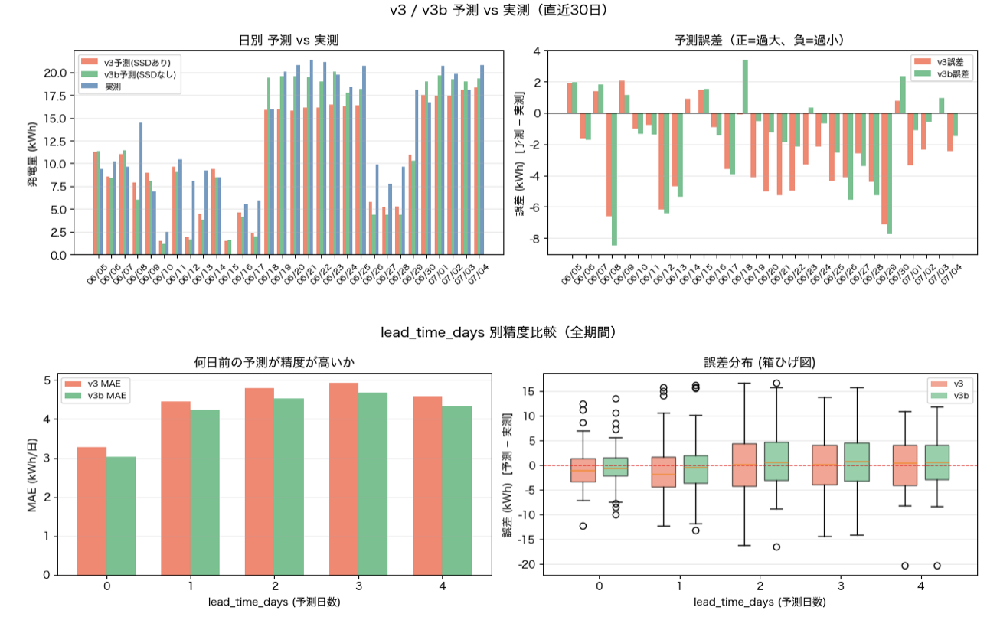

> 精度評価は継続中。日次での予測・検証サイクルを運用している

---

# 運用を通じた説明変数の見直し

- 初期モデルは説明変数の選定を含めて生成AIに一任し、一定の精度を確保
- 運用開始から約1ヶ月後、予測値に異常が見られたため要因を調査
- 5日前の日射量やその移動平均など、妥当性の低い説明変数が含まれていたことが判明
- 説明変数を見直し、モデルを再構築

### モデル変遷

| バージョン | 期間 | 説明変数 | CV MAE |
|-----------|------|---------|--------|
| v1 | 〜2026-05-17 | 8変数（GSR・TMP_max・月sin/cos・GSR_5day_avg・GSR_5day_ago等） | — |
| v2 | 2026-05-18〜06-06 | 6変数（GSR・GSR_ratio・TMP_max 等） | 2.23 kWh |
| **v3** | **2026-06-07〜** | **3変数（GSR・GSR_ratio・SSD）** | **2.08 kWh** |
| v3b | 2026-06-23〜 | 2変数（GSR・GSR_ratio、SSD除外） | 2.22 kWh |

変数を絞り込むたびに精度が向上（CV MAE 2.23→2.08 kWh）

---

# 現行モデル（v3 / v3b 並行稼働）

> **2026-06-07 より v3 移行・2026-06-23 より v3b 並行稼働**

| 項目 | v3（SSDあり） | v3b（SSDなし） |
|------|-------------|--------------|
| 説明変数 | GSR・GSR/平年比・SSD（3変数） | GSR・GSR/平年比（2変数） |
| CV MAE | **2.08 kWh/日** | 2.22 kWh/日 |
| ファイル | `rf_hatuden.joblib` | `rf_hatuden_no_ssd.joblib` |

**並行稼働の理由**: SSD 予報が晴れ日に著しく過小評価（翌日予報 bias=−7.7h/day）されており、v3 の発電量予測を系統的に引き下げている可能性を検証中。

| 天気区分 | v3 MAE（翌日） | v3b MAE（翌日） |
|---------|-------------|--------------|
| 晴れ日（SSD実測 ≥ 5h） | *3.68 kWh* | **1.73 kWh** |
| 曇り日（SSD実測 < 5h） | **2.61 kWh** | 3.22 kWh |

GSR（全天日射量）の予測と実測の検証

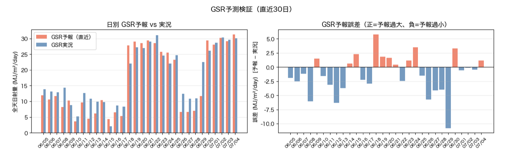

SSD（日照時間）の予測と実測の検証

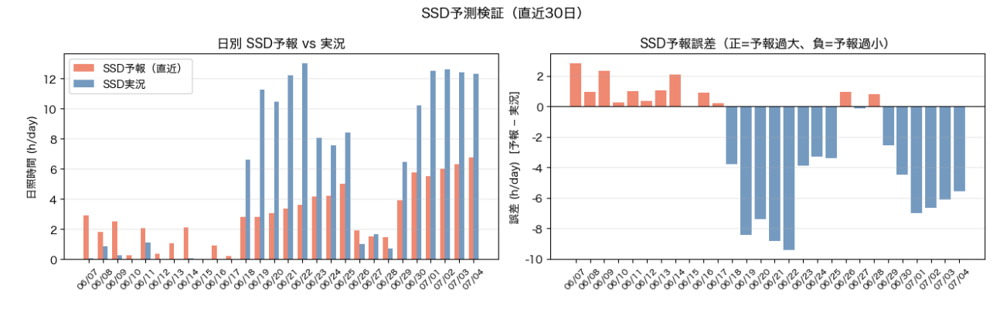

> 発電量予測は蓄電池の充電判断にも活用（晴天時は太陽光優先、悪天候時は夜間電力）。個人宅では不要でも、大規模な太陽光＋蓄電池運用では有効と考えられる

---

<!-- _backgroundColor: "#dbeafe" -->
<!-- _color: "#1e3a8a" -->
<!-- _paginate: false -->

# バイブコーディングとは

---

# 「vibe coding」という言葉の由来

- 2025年2月、AI研究者アンドレイ・カルパシー氏（元Tesla AI責任者・OpenAI共同創業者）がXで提唱
- 日本語では「感覚駆動開発」「ノリ駆動開発」と訳されることもあり、字面だけ見ると軽い言葉に映るが、実際は**個人開発・プロトタイピングに特化した開発スタイル**を指す言葉

"There's a new kind of coding I call **'vibe coding'**, where you fully give in to the vibes, embrace exponentials, and forget that the code even exists. [...] It's not too bad for throwaway weekend projects."
— Andrej Karpathy (2025/2/2)

- 提唱者本人が「**使い捨ての週末プロジェクト向け**」と明言しており、最初から商用・本番システム開発とは切り分けて語られた概念
- コードを一行ずつ書くのではなく、**見て・言って・動かして・貼り付ける**を繰り返し、動くものを素早く形にする

> **個人開発向き**: ドメイン知識（業務領域の専門知識）を持つ人が自ら作り改良できるので、痒いところに手が届くアプリを素早く形にできる
> **商用アプリ開発とは別物**: レビュー・テスト・セキュリティ対策を伴う本番開発にそのまま持ち込む発想ではなく、あくまで個人の学習・プロトタイピング用途に強みがある開発スタイル

---

# vibe coding X GitHub 私の開発スタイル

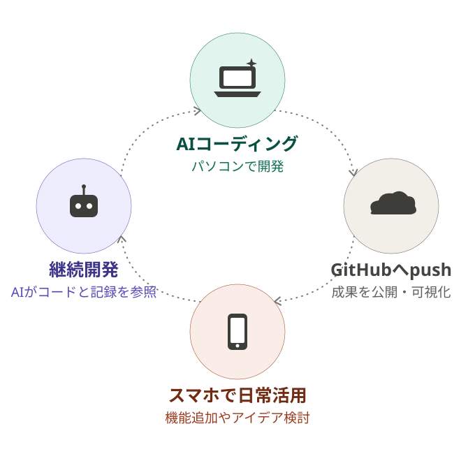

- プログラミングを少しかじった程度で、専門知識はない
- WXBC「アメダス気象データ分析チャレンジ」でPython・機械学習を学んだ
- 生成AIによるプログラミングも同時期に始め、二つの学びが結びついた
- 今年3月からClaude Code×GitHubで、AIに任せてアイデアを形にするスタイルが定着
- コードを完全に理解しなくても「動くもの」を作りながら学べる

> 開発コミュニティも重要 ― 職場のPython_AIグループで日々情報交換。WXBCでもSlack共有の活発化に期待
> このプレゼンもバイブコーディングで自動作成。学習目的ならAIに解説させながら開発する方が向く

---

<!-- _class: hero-gradient -->
<!-- _paginate: false -->

# まとめ・今後の展開

- バイブコーディングは、開発の専門知識がなくても「作りたいもの」を言葉にできれば形にできる開発スタイル
- 気象データは公開されていて生活に密着し、学習素材として最適。WXBCの教材＋AIと組み合わせれば、データの扱い方とAI活用を同時に身につけられる
- 開発経験がなくても、気象データへの興味と好奇心さえあれば形にできる ― バイブコーディングは、WXBCが対象とする層に有効な開発手法
- 開発中の各ツールは、GitHubで成果をみえる化し、運用しながら継続的に改善を実施
- 電力データ分析、太陽光発電予測を毎日実行、天気図生成、ローカルLLM、ネット情報まとめなどテーマを拡張中

以上
